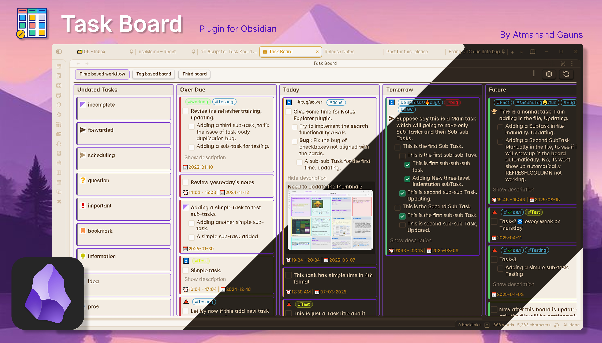

	<h1 align="center"><b>Task Board</b></h1>
	<h3 align="center"><b>"Document your progress while completing your tasks"</b></h3>

 

    
    
    
     
	
<!-- 	 -->
	<a href="[https://img.shields.io/github/v/release/tu2-atmanand/Task-Board?style=flat-square](https://img.shields.io/github/v/release/tu2-atmanand/Task-Board)">
    
</a>

 

An [Obsidian](https://obsidian.md/) plugin to view and manage all your tasks, throughout the vault in a much efficient Kanban board format.

> Introductory YouTube video : [Task Board plugin - Introduction](https://youtu.be/ZizsPBuXW8g)

This plugin is designed to help you document your work seamlessly from start to finish while completing a specific task. With this plugin, you can quickly open a task without manually accessing the markdown file, allowing you to add solutions, key points, resources, and even sub-tasks effortlessly.

Inspired by the [GitHub Projects Board Layout](https://docs.github.com/en/issues/planning-and-tracking-with-projects/customizing-views-in-your-project/changing-the-layout-of-a-view#about-the-board-layout), the goal is to bring the full functionality of GitHub Projects into Obsidian. This will enable you to manage private projects efficiently or even create a collaborative workspace within Obsidian.

## **Documentation**

This readme will only provide a basic information. Ill highly recommend to go through the docs to understand the plugin better and to make use of **Task Board** efficiently : [**Task Board Documentation**](https://tu2-atmanand.github.io/task-board-docs/).

## Discussion

Join the forum top to share your thoughts, ideas or requests and hear from other, how they have adapted to this GTD methodologies to get their tasks done and complete projects inside Obsidian : [**Task Board topic on Obsidian forum**](https://forum.obsidian.md/invites/WDTPqhvJUD)

## How Does it work ?

- It scans tasks from all the Markdown files from your whole vault and show them on a Kanban type board.
- Edit the task directly from the Task Board, without opening the Markdown file.
- See Real-Time changes in the parent markdown file.
- Add task to currently opened files using a pop-up window.

## How to start ?

**Step 1 :** Install and Enable the plugin : [How to install Task Board](https://tu2-atmanand.github.io/task-board-docs/docs/Installation/).

**Step 2 :** Open Task Board using the Icon from the right side Ribbon Icon Bar. There is also a command in the Command Pallet.

**Step 3 :** Click on the **Scan vault window** button from the top-right corner in the Task Board view header. Then click on the run button and it will scan all your files to look for tasks. If your vault contains thousands of notes, you can apply [scanning filters](https://tu2-atmanand.github.io/task-board-docs/docs/Features/Filters_for_Scanning/) to exclude certain files from scanning.

**Step 4 :** There are already two predefined board for your convenience as an example. Feel free to delete or edit the boards and [create your own boards](https://tu2-atmanand.github.io/task-board-docs/docs/How_To/HowToCreateNewBoard/) from the Configure Board settings. Enjoy !

## Features

### Task Formats

This plugin can scan all kinds of task formats which are supported by the [Tasks plugin](https://github.com/obsidian-tasks-group/obsidian-tasks). Whether the tasks are multi-level indented tasks, tasks from callouts and tas with checkboxes starting with the patterns `- [ ]`, `+ [ ]`, `* [ ]` or `> [ ]` will be scanned.

Additionally, you can add multi-level sub-tasks and body description with images and files with the accepted format as explained in the docs. Following is an example of a task :

> **NOTE :** Tasks inside callout will be considered as single tasks. That is, it will not be possible for these tasks to have sub-tasks or description.

### Adding a Task

There are 4 ways to add a new task.

**Obvious Method :** Your old way of adding a task, that is directly writing inside the markdown files. After you have written the content of the task switch you focus away from the editor, like click on the Task Board and your task will be directly added in the board. Provided you havent applied Scan Filters on that edited file.

**In the active file :** The plugin provides a command to open the `Add New Task` modal to add new task directly at the current cursor position in the active note.

**In the pre-defined file :** The plugin also provides another command to open the `Add New Task` modal to add new task directly inside the pre-defined file you have selected in the note. This will help to add a new task from anywhere in Obsidian.

**Using button :** The plugin provides a button in the board header to open the `Add New Task` modal to add new task directly in either the pre-defined note or any other note using the file selector.

> With the integration of [QuickAdd plugin](https://github.com/chhoumann/quickadd), this feature can become a very powerful tool.

### Marking as Complete

Marking a Task as complete from the board is real-time, as soon as you will mark or unmark the task, the changes will be instantly made in the parent markdown file.

### Editing a Task

Edit task directly from the Edit Task Window. You can add different properties to the task, add more subTask, add or edit description to the task. And the changes will be return to the parent markdown file exactly the way you see it in the preview.

### Deleting a Task

Directly delete unwanted task from the board using the delete Icon. The task will also be deleted from the parent markdown file.

### Applying Filters

Apply Board filters to filter out and see the urgent tasks on the board with ease. Filters for Columns coming soon.

## Upcoming Features

- **Task Sorting :** Sorting feature for each individual Column.
- **Drag N Drop for Tasks :** User will be able to drag and drop tasks from one column to another for easy editing fields.
- **New Board Type :** A new type of Board called `Static Board` will be added, which will work with a single markdown file, similar to the Kanban Plugin.
- **Comments and Activity :** Using the Add or Edit task modal, you can add comments to the task, which will help you to document everything you were doing while working on this task, similar to GitHub Projects Planning Issus feature.

## How to Contribute

You can contribute to this project by :

**1. Requesting a new feature, suggesting an improvement or reporting a Bug :** [How to create a new request](https://tu2-atmanand.github.io/task-board-docs/Advanced/HowToCreateRequest.html).

**2. Improving the translated languages or add a new language :** [How to Contribute for Language Translation](https://tu2-atmanand.github.io/task-board-docs/Advanced/Contribution_For_Languages.html).

**3. Contribute to the Development of the plugin Code :** : [How to join the plugin development](https://tu2-atmanand.github.io/task-board-docs/Advanced/HowToJoinDevelopment.html).

## Motivation for the Project

I always used the [Kanban Plugin](https://github.com/mgmeyers/obsidian-kanban) to manage my tasks. And it use to work nice for me with all the amazing features. But as soon as I came across the [CardBoard plugin](https://github.com/roovo/obsidian-card-board), everything changed. The idea of adding tasks anywhere in your vault and managing them from a single board amazed me. While using Kanban plugin the only issue I had was to open the board and then add a new task in that board/file. This sometimes use to become a little distracting for me to navigate to the specific board, search for the task and to edit it, etc.. I immediately switched to the CardBoard plugin after I came across it. But after using it for few days, I realized there are few important features this plugin is lacking and it's development has been on hault from a long time. So I went to first contribute to the main project, but I wasn't familiar with the elm files, hence decided to start my own plugin.

While development I took inspirations from CardBoard and Kanban plugin as well as many feature ideas from [GitHub Project Kanban board](https://docs.github.com/en/issues/planning-and-tracking-with-projects/customizing-views-in-your-project/changing-the-layout-of-a-view#about-the-board-layout). I hope I am able to give the best of all this three plugins into one, and will be improving this further.

## Support

A great effort of work has been put into this idea to make it happen. I created the plugin for personal use, but I believed it will surely help other to make their work easier in managing tasks and handling project. If you have got benefitted with this plugin, consider donating for further improvement of this idea.

## License

Task Board is licensed under GNU GPL V3. Refer to [LICENSE](https://github.com/tu2-atmanand/Task-Board/blob/main/LICENSE) for more information.
