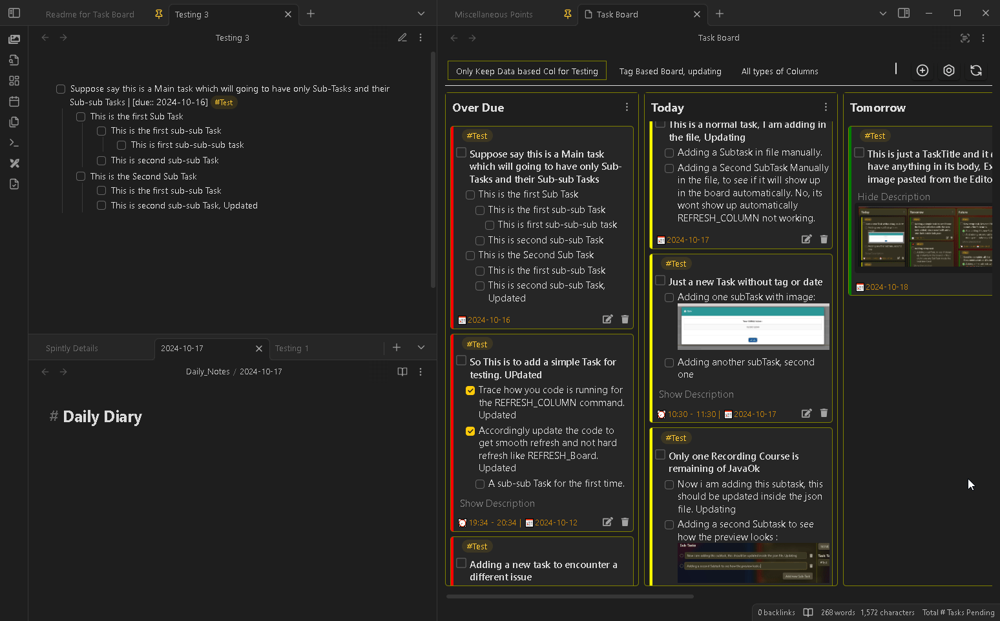

# Task Board Features

### Task Formats

This plugin will only detect and work with the checkbox items/tasks which are in a specific format. You can use the other formats to make the plugin ignore those tasks or subtasks.
Checkout in Details here : [Task Formats](Task_Formats.md)

### Marking as Complete

Marking a Task as complete from the board is real-time, as soon as you will mark or unmark the task, the changes will be instantly made in the parent markdown file.
Checkout detailed information here : [Marking a task complete](MarkdingTaskComplete.md)

### Editing a Task

Edit task directly from the Edit Task Window. You can add different properties to the task, add more subTask, add or edit description to the task. And the changes will be return to the parent markdown file exactly the way you see it in the preview.
Checkout detailed information here : [Editing a task](EditingATask.md)

### Deleting a Task

Directly delete unwanted task from the board using the delete Icon. The task will aslo be deleted from the parent markdown file.

### Applying Filters

Apply Board filters to filter out and see the urgent tasks on the board with ease. Filters for Columns coming soon.
